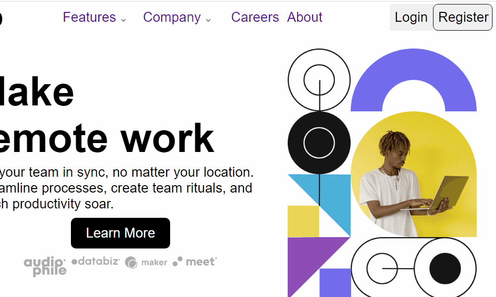

# Desafio Intro Section with Dropdown Navigation do site frontendmentor.io


## Descrição:
SPA responsiva. Site de introdução com menu dropdown.\
<a href="https://femchallenge-intro-section.vercel.app/">Link do site, veja o responsivo</a>


## Indice
- <a href="#aprendizagens">Aprendizagens</a>
- <a href="#funcionalidades"> Funcionalidades </a>
- <a href="#tecnologias"> Tecnologias </a>
- <a href="#rodar"> Rodar </a>
- <a href="#colaboradores"> Colaboradores </a>
- <a href="#next"> Next </a>
- <a href="#contato"> Contatos </a>

## Aprendizagens
- [x] Componentização.
- [x] Utilização do useState para manipular elementos html.

## Funcionalidades
- [x] Pagina Intro com menu dropdown

## Tecnologias
1. [React](https://pt-br.reactjs.org)
2. [Flexbox CSS](https://developer.mozilla.org/pt-BR/docs/Web/CSS/CSS_Flexible_Box_Layout/Basic_Concepts_of_Flexbox/)
3. [Typescript](https://www.typescriptlang.org/docs/)
4. [Vite](https://vitejs.dev/)


## Rodar
```bash
# Projeto inicializado npm create vite@latest

# Clone o repositório na pasta desejada
$ git clone https://github.com/vitorhub/intro-section.git

# Acesse a pasta do projeto no seu terminal
$ cd intro-section/

# Instale as dependencias
$ npm install

# Inicialize o projeto no navegador
$ npm run dev

# Para criar o arquivo de produção
$ npm run build

# A aplicação será acessada na porta 5173,
acesse pelo navegador: http://127.0.0.1:5173/
```

## Colaboradores
Vitor Falcao\


## Next
- [ ] Alterar o click do dropdown para mouseout mouseover

## Contato
<a href="https://www.linkedin.com/in/vitorfalcaodesenvolvedor/"> Linkedin </a>
